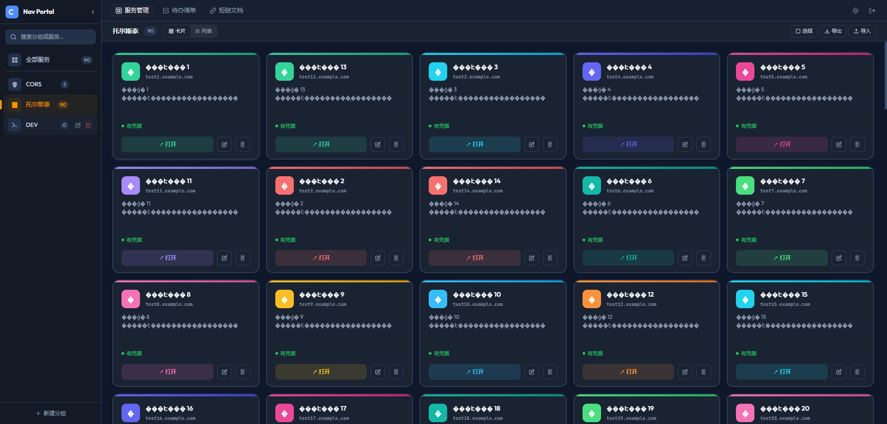
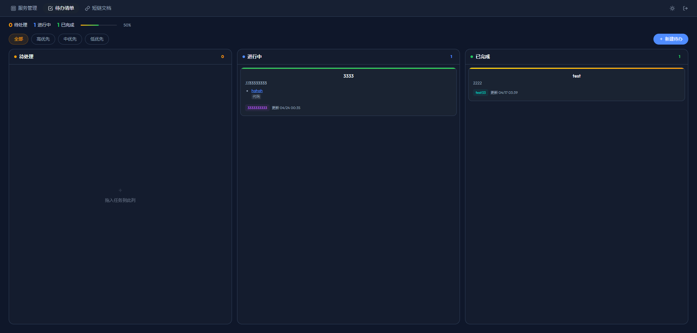
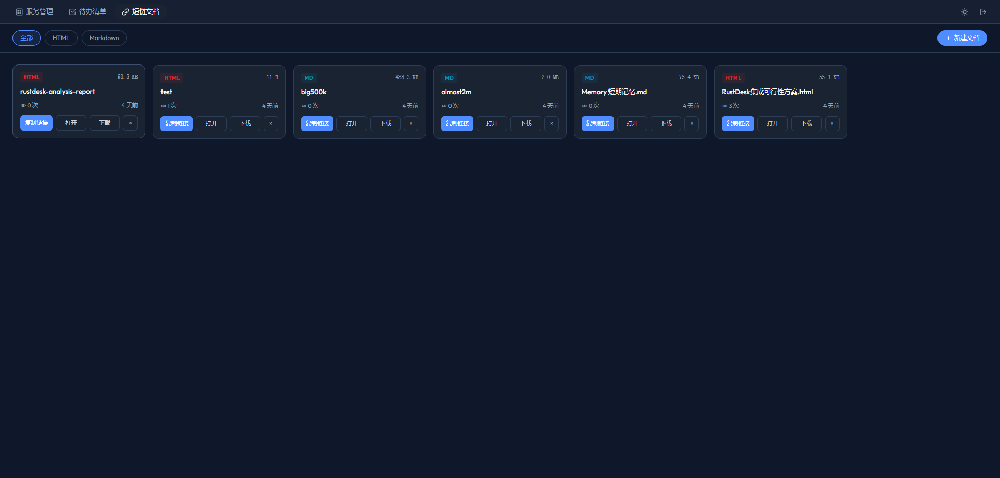
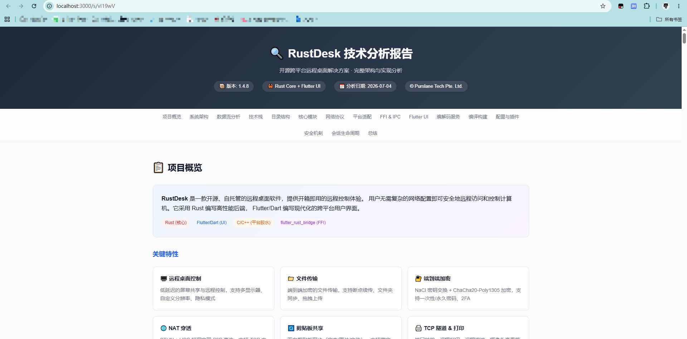

# Internal Nav - 内部系统导航页

一个简洁、高效的内部系统导航管理工具，用于统一管理企业内部各类系统的访问入口和登录凭据。

## 功能特性

- **树形分组管理** - 支持无限层级嵌套的分组结构，方便按部门/项目组织系统
- **服务卡片** - 记录系统名称、URL、用户名、密码等信息，一键打开并复制凭据
- **拖拽排序** - 支持分组和服务卡片的拖拽排序，灵活调整展示顺序
- **标签系统** - 多标签分类，支持自定义标签名称和颜色，卡片背景按标签颜色显示
- **数据导入导出** - 支持 JSON 导入和 Markdown 导出，便于备份和迁移
- **简洁白主题** - 清爽的白色界面设计，专注核心功能

## 技术栈

- **前端**: Vue 3 + Vite + Tailwind CSS + Pinia
- **后端**: Node.js + Express
- **数据库**: SQLite (better-sqlite3)

## 快速开始

### 本地开发

```bash
# 克隆项目
git clone <repository-url>
cd cool-bav

# 安装依赖
npm install

# 开发模式（同时启动前后端）
npm run dev

# 或分别启动
npm run dev:server  # 启动后端 (http://localhost:3000)
npm run dev:client  # 启动前端开发服务器
```

### 生产构建

```bash
# 构建前端
npm run build

# 启动生产服务
npm start
```

服务将在 `http://localhost:3000` 启动。

## 安全机制

系统内置鉴权机制，首次访问需要输入鉴权秘钥：

- **默认秘钥**: `cool-nav-2024`（生产环境请通过环境变量修改）
- **有效期**: 30 天，过期后需重新输入
- **退出登录**: 点击侧边栏底部的「退出」按钮

### 配置环境变量

```bash
# 设置自定义鉴权秘钥（推荐）
export AUTH_SECRET_KEY="your-secret-key"

# 设置认证加密密钥
export AUTH_SECRET="your-auth-secret"
```

### Docker 部署时配置

```bash
docker run -d \
  -p 3000:3000 \
  -e AUTH_SECRET_KEY="your-secret-key" \
  -v internal-nav-data:/app/data \
  internal-nav:latest
```

## Docker 部署

### 构建镜像

```bash
# 构建镜像
docker build -t internal-nav:latest .

# 运行容器
docker run -d \
  --name internal-nav \
  -p 3000:3000 \
  -v internal-nav-data:/app/data \
  internal-nav:latest
```

### 使用 Docker Compose

```yaml
version: '3.8'
services:
  internal-nav:
    image: internal-nav:latest
    container_name: internal-nav
    ports:
      - "3000:3000"
    volumes:
      - internal-nav-data:/app/data
    restart: unless-stopped

volumes:
  internal-nav-data:
```

```bash
docker-compose up -d
```

### 数据持久化

数据库文件存储在容器的 `/app/data` 目录，建议挂载卷以保证数据持久化：

```bash
docker run -d \
  -p 3000:3000 \
  -v /path/to/data:/app/data \
  internal-nav:latest
```

## 系统页面

### 服务管理

服务管理是系统的核心模块，用于统一管理企业内部各类系统的访问入口和登录凭据。支持树形分组、拖拽排序、标签分类、卡片/列表双视图切换，以及批量选择和导入导出功能。



### 待办清单

待办清单提供看板式的任务管理功能，支持「待处理 → 进行中 → 已完成」三栏拖拽流转。可按优先级筛选（全部/高优先/中优先/低优先），实时显示任务统计和完成进度，支持子任务、标签和备注。



### 短链文档

短链文档模块用于管理和分享 HTML/Markdown 文档。上传文档后自动生成短链接，支持复制链接、在线预览、源文件下载。文档卡片显示文件大小、访问次数和上传时间，可按类型筛选（全部/HTML/Markdown）。



### 文档查看器

文档查看器支持在线预览 Markdown 和 HTML 文档内容。自动解析 Markdown 语法并渲染为美观的排版，支持代码高亮、表格、列表等富文本展示，提供完整的文档阅读体验。



## 项目结构

```
cool-bav/
├── server/                 # 后端代码
│   ├── index.js           # 入口文件
│   ├── database.js        # 数据库操作
│   └── routes/            # API 路由
│       ├── groups.js
│       ├── services.js
│       ├── tags.js
│       ├── export.js
│       └── import.js
├── src/                   # 前端代码
│   ├── api/              # API 请求
│   ├── components/       # Vue 组件
│   ├── stores/           # Pinia 状态管理
│   ├── types/            # TypeScript 类型
│   └── views/            # 页面视图
├── data/                  # SQLite 数据库存储目录
├── dist/                  # 构建输出目录
├── Dockerfile            # Docker 构建文件
└── package.json          # 项目配置
```

## 配置说明

### 环境变量

| 变量名 | 默认值 | 说明 |
|--------|--------|------|
| `PORT` | 3000 | 服务端口 |
| `NODE_ENV` | development | 运行环境 |
| `AUTH_SECRET_KEY` | cool-nav-2024 | 鉴权秘钥（首次登录需要输入） |
| `AUTH_SECRET` | cool-nav-secret-key-2024 | Token 加密密钥 |

## License

MIT